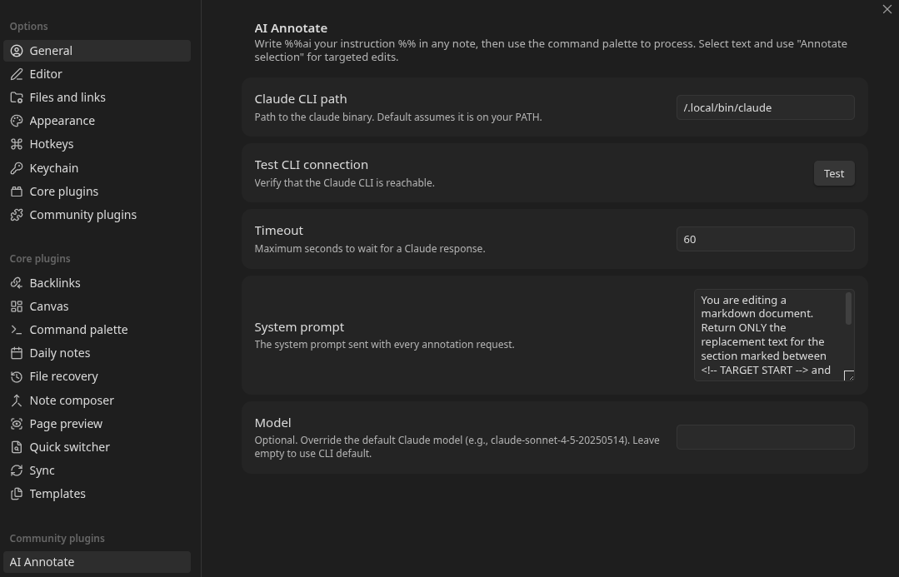
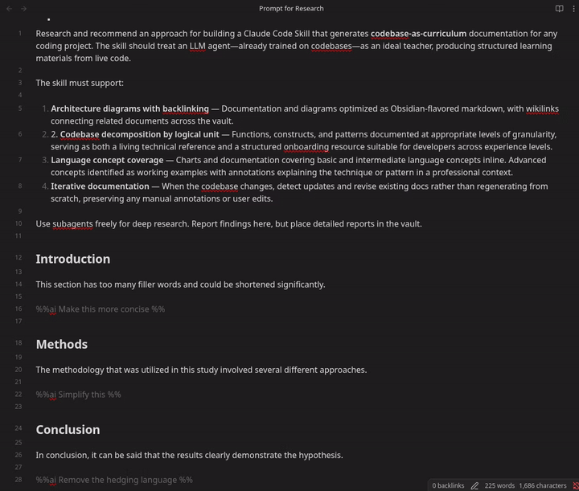
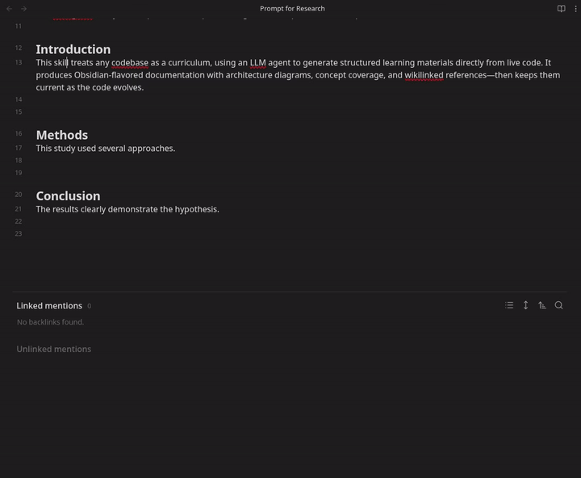
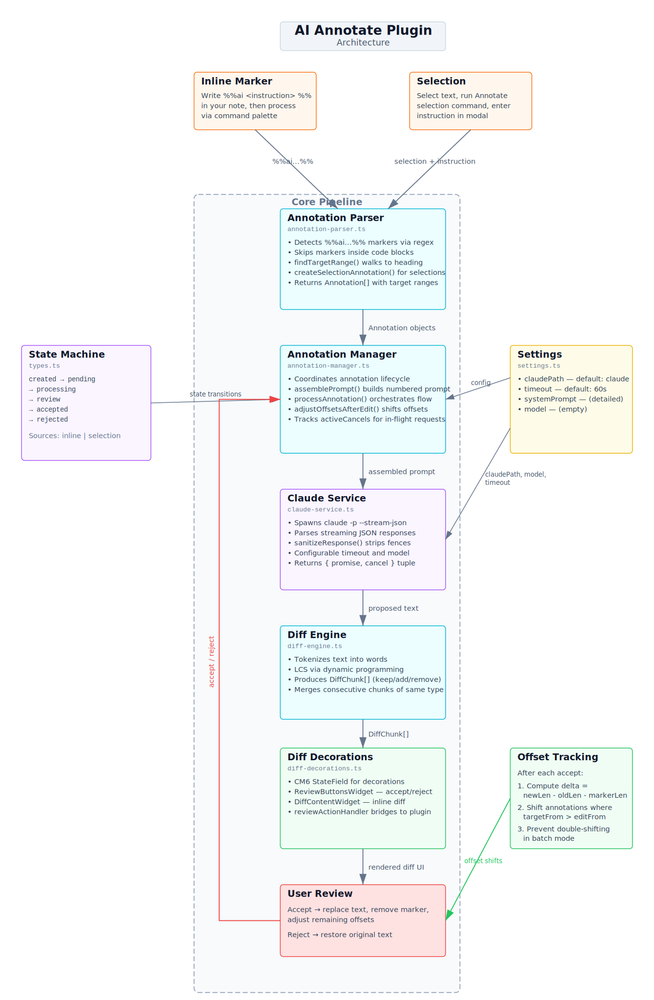

# AI Annotate

An Obsidian plugin for inline LLM-powered editing. Write natural language instructions directly in your notes — as inline markers or text selections — and Claude proposes changes that you review, accept, or reject in a track-changes style interface.

No API keys required. The plugin uses the [Claude CLI](https://docs.anthropic.com/en/docs/claude-code) with your existing Claude subscription.

> **Network usage:** This plugin spawns the Claude Code CLI as a local process, which sends your note content to [Anthropic's API servers](https://www.anthropic.com) for processing. No data is transmitted except through the CLI — the plugin itself makes no network requests. See Anthropic's [privacy policy](https://www.anthropic.com/privacy) for how data is handled.

## Requirements

- [Obsidian](https://obsidian.md) v1.5.0 or later (desktop only)
- [Claude Code](https://docs.anthropic.com/en/docs/claude-code) CLI installed and authenticated

## Installation

### Manual install

1. Download or clone this repository
2. Copy the `ai_annotate` folder into your vault's `.obsidian/plugins/` directory
3. Run `npm install && npm run build` inside the `ai_annotate` folder
4. Restart Obsidian
5. Go to **Settings > Community plugins**, disable Restricted mode, and enable **AI Annotate**

### Development install (symlink)

```bash
cd ai_annotate
npm install
npm run build

# Symlink into your vault
ln -s "$(pwd)/main.js" "/path/to/vault/.obsidian/plugins/ai-annotate/main.js"
ln -s "$(pwd)/manifest.json" "/path/to/vault/.obsidian/plugins/ai-annotate/manifest.json"
ln -s "$(pwd)/styles.css" "/path/to/vault/.obsidian/plugins/ai-annotate/styles.css"
```

### Configuration

Open **Settings > AI Annotate** to configure. In most cases the defaults work out of the box — you only need to set the CLI path if `claude` isn't on Obsidian's PATH.



- **Claude CLI path** — Full path to the `claude` binary (e.g., `/home/user/.local/bin/claude`). Required if `claude` is not on Obsidian's PATH. Use the **Test** button to verify the path works.
- **Timeout** — Maximum seconds to wait for a Claude response (default: 60).
- **Model** — Optional. Override the default Claude model (e.g., `claude-sonnet-4-5-20250514`). Leave empty to use the CLI default.
- **System prompt** — The instruction sent to Claude with every request. The default tells Claude to return only the replacement text for the targeted section.
- **Context sent to Claude** — Controls how much of the document is included in each prompt. Options:
  - *Section ± neighbors* (default) — the heading section containing the target plus adjacent sections. Balances context awareness with token cost.
  - *Target section only* — just the heading section containing the target. Lowest token usage.
  - *Full document* — the entire note. Maximum context but highest token cost.
- **Extra CLI arguments** — Additional arguments appended to the `claude` command (e.g., `--max-turns 5`). See the [CLI reference](https://code.claude.com/docs/en/cli-reference).
- **Environment variables** — One `KEY=VALUE` per line, merged into the CLI process environment.

## Usage

### Inline markers

Write `%%ai <instruction> %%` on its own line in your note. The text between the preceding heading (or start of document) and the marker becomes the target that Claude will edit.

```markdown
## Introduction

This paragraph has too many filler words and could benefit from
being more concise and direct in its language.

%%ai Make this more concise %%
```

**To process:** Place your cursor on or near the `%%ai` line (within 3 lines, or anywhere in the target section) and run **"Process annotation at cursor"** from the command palette (`Ctrl+P` / `Cmd+P`).

Claude's proposed changes appear as an interleaved inline diff — deletions in red with strikethrough (prefixed `−`), additions in green (prefixed `+`), shown adjacent at each change point. Click **Accept** to apply the changes (the `%%ai` marker is also removed) or **Reject** to keep the original text.



### Selection-based annotations

1. Highlight any text in your note
2. Open the command palette and run **"Annotate selection"**
3. Type your instruction in the modal (e.g., "Add more detail", "Rewrite for clarity")
4. Press the **Process** button or `Ctrl+Enter` / `Cmd+Enter`

The diff appears inline over the selected text with the same accept/reject controls.



### Batch processing

Scatter multiple `%%ai` markers throughout a document, then run **"Process all annotations"** from the command palette. Each annotation is processed sequentially, and you can accept or reject each one individually — even while others are still being processed.

### Accept all / Reject all

After processing multiple annotations, use **"Accept all changes"** or **"Reject all changes"** from the command palette to resolve them all at once.

## Commands

| Command | Description |
|---|---|
| Process annotation at cursor | Process the `%%ai` marker at the current cursor position |
| Process all annotations | Find and process every `%%ai` marker in the document |
| Annotate selection | Open instruction modal for the currently selected text |
| Accept all changes | Accept all pending proposed changes |
| Reject all changes | Reject all pending proposed changes |

No default hotkeys are assigned. Bind them in **Settings > Hotkeys** to your preference.

> **Note:** `%%ai` markers inside fenced code blocks and inline code are ignored, so you can safely document the syntax without triggering processing.

## How it works

1. You create an annotation (inline marker or selection)
2. The plugin assembles a prompt containing document context (scoped by the context strategy setting) with line numbers, the target section marked with delimiters, and your instruction
3. The prompt is sent to Claude via the CLI (`claude -p --output-format stream-json`)
4. Claude's response is diffed against the original text
5. The diff is rendered inline using CodeMirror 6 decorations
6. You accept (document updated) or reject (original preserved)

The document is never modified until you explicitly accept a change.

## Architecture



The diagram maps the full pipeline — from user trigger through parsing, prompt assembly, CLI invocation, diffing, and the review UI — along with the state machine, settings, and offset tracking. An interactive version is also available as [architecture.canvas](architecture.canvas) in Obsidian.

## License

MIT
